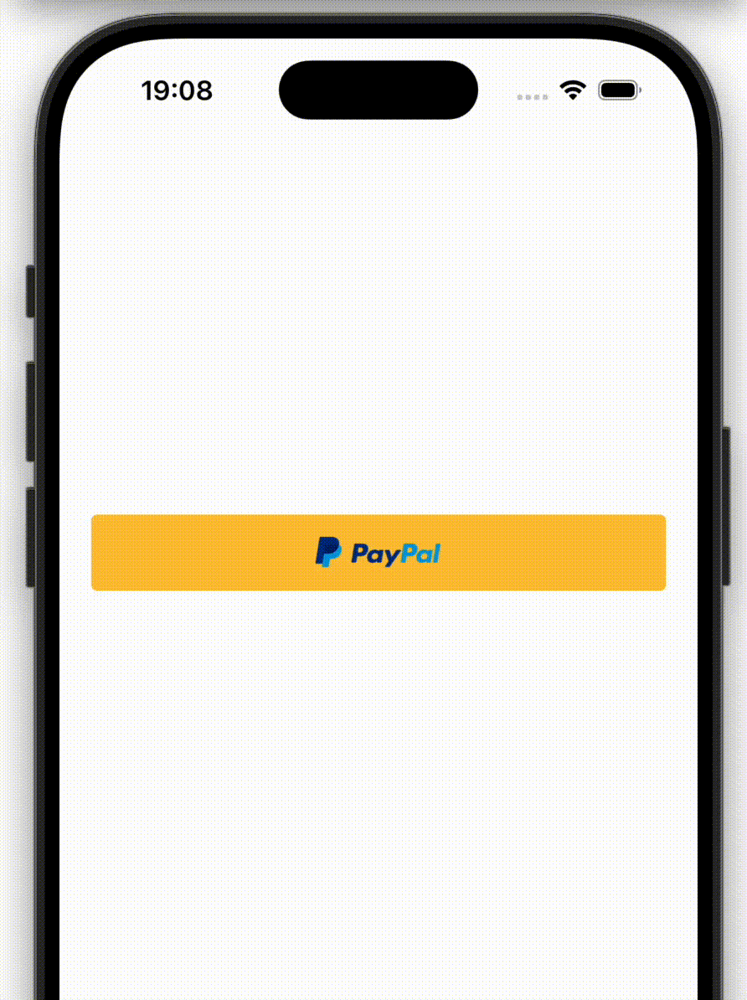

# react-native-paypal-web-payments

PayPal Web Payments native integration for React native and Expo.



## Table of Contents
- [Installation](#installation)
  - [Setup](#setup)
- [Usage](#usage)
- [Useful Links](#useful-links)
- [Contributing](#contributing)
- [License](#license)

## Installation

```sh
npm install react-native-paypal-web-payments
```

### Setup

<details>
<summary>Bare React Native</summary>

1. Add `onNewIntent` to the MainActivity in your app:
    ```kt

    import android.content.Intent
    // ...

    class MainActivity : ReactActivity() {

      // ...
      
      override fun onNewIntent(newIntent: Intent?) {
        super.onNewIntent(newIntent)
        intent = newIntent
      }
    ```

2. Update your app's AndroidManifest.xml with your custom URL scheme in the intent-filter
    ```xml
    <activity
      android:name=".MainActivity"
      ...>
      ...
      <intent-filter>
        <action android:name="android.intent.action.VIEW" />
        <data android:scheme="custom-url-scheme" />
        <category android:name="android.intent.category.DEFAULT" />
        <category android:name="android.intent.category.BROWSABLE" />
      </intent-filter>
    </activity>
    ```
</details>

<details>
<summary>Expo</summary>

1. Update expo config
    ```tsx
    {
      "expo": {
        "scheme": "custom-url-scheme",
        "plugins": [
          "react-native-paypal-web-payments"
        ]
      }
    }
    ```

</details>


## Usage


```js
import {
  startCheckout,
  PaypalEnvironment,
  PayPalWebCheckoutFundingSource,
} from 'react-native-paypal-web-payments';
import { PayPalButton } from "react-native-paypal-button";
// ...
  <PayPalButton
    onPress={() => {
      startCheckout({
        clientID: "client-id",
        environment: PaypalEnvironment.sandbox,
        urlScheme: "url-scheme",
        orderID: "order-id",
        fundingSource: PayPalWebCheckoutFundingSource.paypal,
        onEvent: (result) => {
          console.log(result);
        },
      })
    }}
  />
```

## Useful Links
- [PayPal Developer Dashboard](https://developer.paypal.com/api/rest/#link-getstarted)
- [PayPal Order v2 API](https://developer.paypal.com/docs/api/orders/v2/)
- [PayPal iOS SDK](https://developer.paypal.com/docs/checkout/advanced/ios/)
- [PayPal Android SDK](https://developer.paypal.com/docs/checkout/advanced/android/)

## Contributing

See the [contributing guide](CONTRIBUTING.md) to learn how to contribute to the repository and the development workflow.

## License

MIT

---

Made with [create-react-native-library](https://github.com/callstack/react-native-builder-bob)
